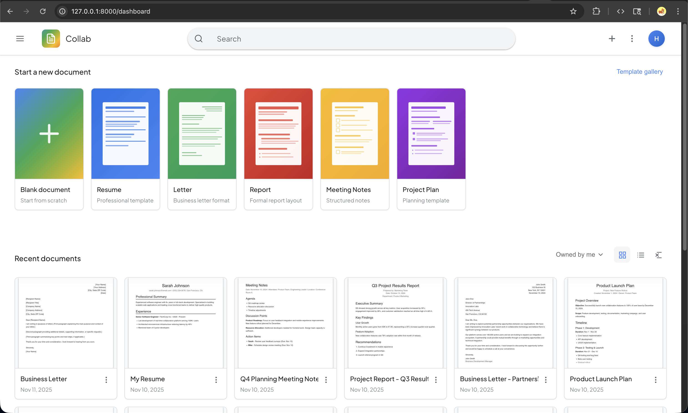
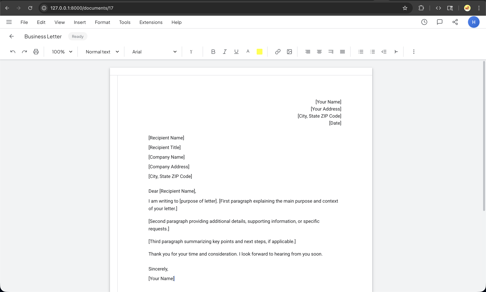

# Collab - Real-time Collaborative Document Editor

A real-time collaborative document editor built with Laravel and Pusher WebSockets.





## Tech Stack

-   **Backend:** Laravel 12
-   **Database:** MySQL/PostgreSQL
-   **Real-time:** Pusher WebSockets
-   **Frontend:** Blade templates + Vanilla JavaScript

## Installation

```bash
# Install dependencies
composer install
npm install

# Configure environment
cp .env.example .env
php artisan key:generate

# Configure database and Pusher in .env
DB_CONNECTION=mysql
DB_DATABASE=collab
PUSHER_APP_ID=your-app-id
PUSHER_APP_KEY=your-app-key
PUSHER_APP_SECRET=your-app-secret
PUSHER_APP_CLUSTER=your-cluster

# Run migrations and seed
php artisan migrate
php artisan db:seed --class=DocumentSeeder

# Start server
php artisan serve
```

## API Endpoints

### Authentication

-   `POST /login` - Authenticate user
-   `POST /register` - Create account
-   `POST /logout` - Logout (auth required)

### Documents (Auth Required)

-   `GET /dashboard` - List user documents
-   `GET /documents/{id}` - View document
-   `POST /documents` - Create document
-   `PUT /documents/{id}` - Update document (content/title)
-   `DELETE /documents/{id}` - Delete document

## Database Schema

```sql
-- Documents table
CREATE TABLE documents (
    id BIGINT PRIMARY KEY,
    user_id BIGINT FOREIGN KEY -> users(id) ON DELETE CASCADE,
    title VARCHAR(255),
    content TEXT,  -- Stores HTML
    created_at TIMESTAMP,
    updated_at TIMESTAMP
);
```

## Real-time Broadcasting

### Event: `DocumentUpdated`

-   Broadcasts to private channel: `private-document.{documentId}`
-   Only document owner can subscribe (authorized in `routes/channels.php`)
-   Broadcasts when content is updated (not title-only updates)

### Flow

1. User edits → `PUT /documents/{id}` with content
2. Controller updates database
3. `DocumentUpdated` event broadcasts to channel
4. All subscribed clients receive update

## Key Backend Files

```
app/Http/Controllers/
├── AuthController.php       # Login, register, logout
└── DocumentController.php  # CRUD + broadcasting

app/Models/
├── User.php
└── Document.php             # Belongs to User

app/Events/
└── DocumentUpdated.php      # Broadcasting event

routes/
├── web.php                  # HTTP routes
└── channels.php             # Channel authorization
```

## Security

-   All document routes require authentication
-   Users can only access their own documents (authorization check in controllers)
-   CSRF protection on all POST/PUT/DELETE requests
-   Private channels require ownership verification

## License

MIT
